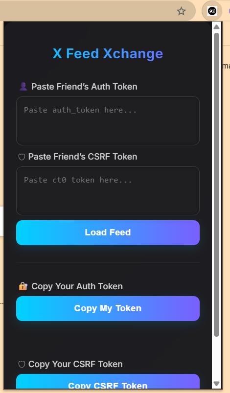
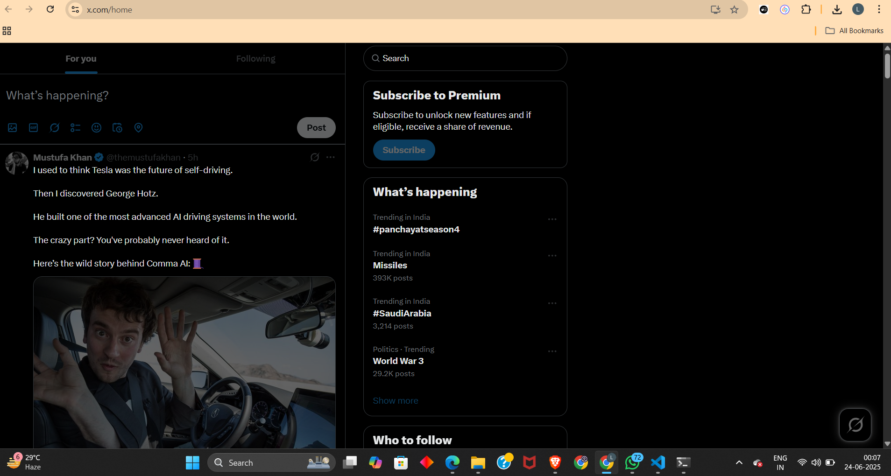

# 🌐 X Feed Xchange – See the World Through Their Feed

**X Feed Xchange** is a browser extension that lets you **view another public user's Twitter (X) feed** — as if you're logged in as them — in a **safe, read-only mode**.  
No likes. No replies. Just see what they see.

> ✅ Made for ethical use only — ideal for developers, researchers, and hackathon demos.

---

## 🧐 What Is This?

Twitter (now X) uses personal signals like follows, likes, and history to create a unique **home feed** for each user. This extension lets you:

- Simulate the **home feed of any public user**
- Do this **without liking, posting, or interfering**
- Copy your own tokens or enter a friend's (with permission)

> This is **read-only** — think of it like "View Only" mode in Google Docs, but for someone's X feed.

---

## 🔧 What You Can Do

✅ Copy your own Twitter session tokens (auth & CSRF)  
✅ Enter another user's tokens to simulate their feed  
✅ View their home timeline in real time  
✅ Hide distracting UI (like sidebars and post buttons)  
✅ Block all interactions — no retweets, replies, or clicks

---
## 🖼️ What It Looks Like


<sub>↑ Enter your tokens or a friend's to load the feed</sub>


<sub>↑ View the feed in read-only mode</sub>

---


## 🚀 How to Install and Use

### 1. Load the Extension in Your Browser

#### For Chrome:
- Go to `chrome://extensions`
- Enable **Developer Mode**
- Click **Load unpacked** → Select this project folder

#### For Firefox:
- Go to `about:debugging`
- Click **Load Temporary Add-on**
- Choose the `manifest.json` file in this folder

---

### 2. Use the Extension

#### Option A: See Your Own Feed (for testing)
- Open Twitter in a tab and log in
- Click the extension icon
- Press **Get Auth Token** and **Get CSRF Token**
- Tokens are copied to your clipboard

#### Option B: See a Friend's Feed
> Ask your friend to copy their tokens using the same steps above

- Paste their `auth_token` and `ct0` values into the extension
- Click **"Use Tokens"**
- The feed will open in a new tab, in **read-only mode**

---

## 🔒 Read-Only Mode

When read-only mode is enabled:
- All buttons (like, follow, retweet, comment) are disabled
- UI elements like headers and sidebars are hidden
- You **cannot interact** — just view

This ensures **privacy, safety, and non-intrusiveness**.

---

## 📁 Project Files

```
x-feed-xchange/
├── popup.html         → Extension interface
├── popup.js           → Token copying and setup logic
├── content.js         → Applies read-only mode on feed
├── background.js      → Sets cookies and mode flag
├── manifest.json      → Extension config
├── style.css          → Simple styling
└── images/icon.png    → Extension icon
```

---

## 🧠 Why This Exists

This extension was built as a **hackathon project** to:
- Explore the personalization of Twitter feeds
- Show how different users view the same platform
- Build ethical, transparent tooling


---

## 👨‍💻 Authors

- **Nilesh**
- **Lakshay Panchal**


